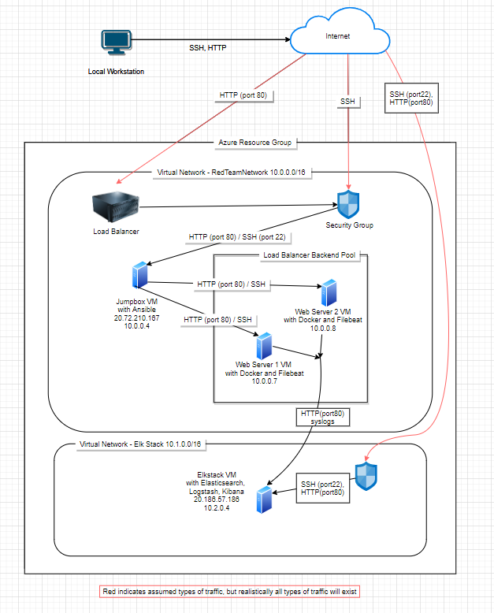
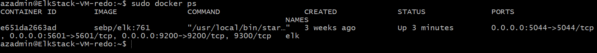

## Automated ELK Stack Deployment

The files in this repository were used to configure the network depicted below.

These files have been tested and used to generate a live ELK deployment on Azure. They can be used to either recreate the entire deployment pictured above. Alternatively, select portions of the [install-elk.yml](install-elk.yml) file may be used to install only certain pieces of it, such as Filebeat.

  - [install-elk.yml](install-elk.yml)

This document contains the following details:
- Description of the Topology
- Access Policies
- ELK Configuration
  - Beats in Use
  - Machines Being Monitored
- How to Use the Ansible Build

### Description of the Topology

The main purpose of this network is to expose a load-balanced and monitored instance of DVWA, the D*mn Vulnerable Web Application.

Load balancing ensures that the application will be highly available, in addition to restricting access to the network.
- What aspect of security do load balancers protect? What is the advantage of a jump box?
 - *Load balancers help protect against Denial of Service attacks, by centralizing configuration for rate limiting technical controls. Further, the load balancer is intended to spread the load of legitimate traffic over several web servers and can decide which server is best for handling the traffic based on the health of the server (Health Probes). Finally, the load balancer can act as a firewall between the assets and the internet, keeping a list of allow/deny rules (Network Security Groups).*
 - *A jump box provides a central point of access for SSH traffic for administrative purposes, while Load Balancers are used to handle HTTP traffic. Having a single point of entry means it’s easier to build in redundant security controls to invoke the principles of network segmentation, least privilege and zero trust.*

Integrating an ELK server allows users to easily monitor the vulnerable VMs for changes to the logs and system traffic.
- What does Filebeat watch for?
 - *Filebeat is a server agent that forwards configurable log data, such as from specified directories or log events, to either Elasticsearch or Logstash.* 
- What does Metricbeat record?
 - *Metricbeat is a server agent that collects metrics from the operating system and services and forwards them to either Elasticsearch or Logstash.*

The configuration details of each machine may be found below.

|    Name    |           Function          | IP Address | Operating System |
|:----------:|:---------------------------:|:----------:|:----------------:|
| Jump Box   | Gateway                     | 10.0.0.4   | Linux            |
| Web 1      | Webserver                   | 10.0.0.7   | Linux            |
| Web2       | Webserver                   | 10.0.0.8   | Linux            |
| ElkstackVM | Search and analytics engine | 10.2.0.4   | Linux            |

### Access Policies

The machines on the internal network are not exposed to the public Internet. 

Only the Jumpbox machine can accept connections from the Internet. Access to this machine is only allowed from the following IP addresses:
- PrivateIP

Machines within the network can only be accessed by the jumpbox.
- TODO: Which machine did you allow to access your ELK VM? What was its IP address?
 - The Jumpbox, IP: 20.72.210.167

A summary of the access policies in place can be found in the table below.

|   Name   | Publicly Accessible | Allowed IP Addresses |
|:--------:|:-------------------:|:--------------------:|
| Jump Box | Yes                 | 10.0.0.4             |
| Web1     | No                  | 10.0.0.7             |
| Web2     | No                  | 10.0.0.8             |

### Elk Configuration

Ansible was used to automate configuration of the ELK machine. No configuration was performed manually, which is advantageous because...
- What is the main advantage of automating configuration with Ansible?
 - *The main advantage of automating using Ansible is administrators do not have to spend as much time replicating the same work across the network. In fact, they can use the playbooks to do common tasks fast and accurately, leaving time to focus on more important matters.* 

The playbook implements the following tasks:
 - Installs Docker
 - Installs Python package installer
 - Increases virtual memory 
 - Downloads and installs the Elk Container

The following screenshot displays the result of running `docker ps` after successfully configuring the ELK instance.

### Target Machines & Beats
This ELK server is configured to monitor the following machines:
- List the IP addresses of the machines you are monitoring
 - Web1 - 10.0.0.7
 - Web2 - 10.0.0.8

We have installed the following Beats on these machines:
- Specify which Beats you successfully installed
 - Filebeat (TODO: file forthcoming)
 - Metricbeat (TODO: file forthcoming)

These Beats allow us to collect the following information from each machine:
- In 1-2 sentences, explain what kind of data each beat collects, and provide 1 example of what you expect to see. E.g., `Winlogbeat` collects Windows logs, which we use to track user logon events, etc.
 - Filebeat can be configured to collect an array of log information. In this project, we connected filebeat using default settings and used dummy data to explore the Kibana data analytics tools for notional network traffic. 

### Using the Playbook
In order to use the playbook, you will need to have an Ansible control node already configured. Assuming you have such a control node provisioned: 

SSH into the control node and follow the steps below:
- Copy the [install-elk.yml](install-elk.yml) file to ansible container.
- Update the playbook file to include two configurations for the local IP where the data is coming from (WebVMs) and where the admin can access the analytics. This second configuration will also require a NSG rule opening the same port specified in the configuration files. 
- Run the playbook, and navigate to the IP address of the Elk container to check that the installation worked as expected.

